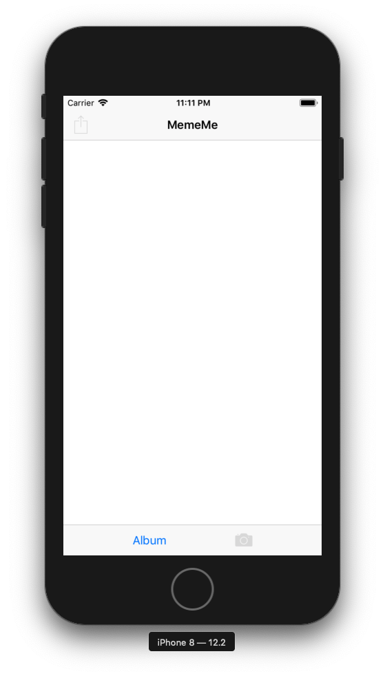
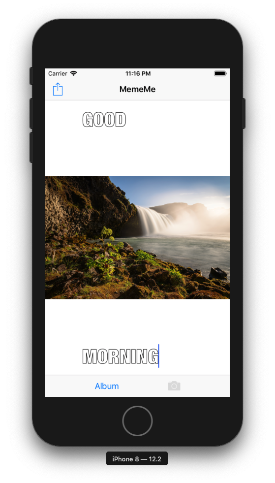
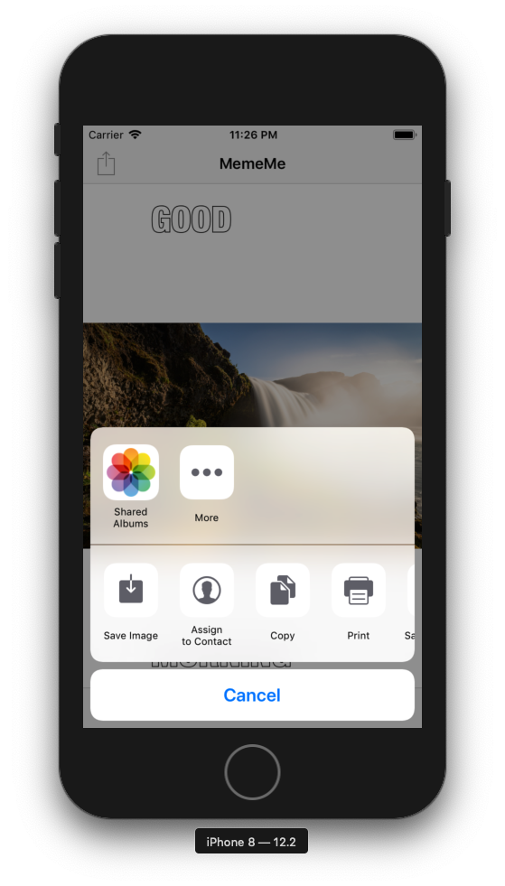

# Udacity iOS Developer Nanodegree - MemeMe1.0 App
This repository contains the MemeMe1.0 app from Udacity's UIKit Fundamentals course. This app utilizes many UIKit components, including 
UIImagePickerController to access the camera and photo album and UIActivityViewController to upload the final result to other apps.

## Overview
MemeMe1.0 allows users to add text to the top and bottom of a picture, either taken using their phone's camera or uploaded 
from their photo album, in order to create a meme. The user can share the photo on social media, by SMS, or through email.

  
